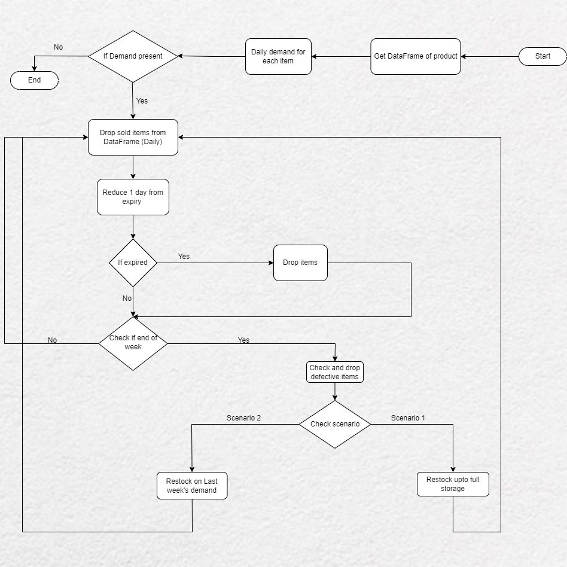
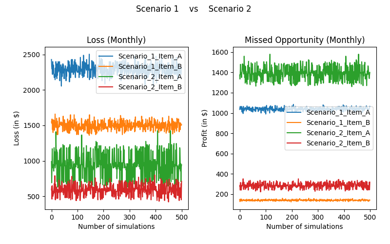

# Perishable products Inventory Management using MC Simulation

Perishable products require accurate inventory control models as their effect on operations management can be critical. Food items such as unprocessed dairy products, or meats or even some medicines require proper handling and have a low shelf-life. The restocking size becomes an important variable considering the uncertain demand and limited storage capacity. Products may also suffer from possible damages during deliveries. The importance of the management was particularly observed during the Pandemic. Thus, it is crucial to have an estimate of demand while restocking so that wastage is avoided and profits are maximized. 

## Objective:
Our main objective is to investigate the effect of adopting an optimum inventory for these perishable goods. And we plan on using Monte Carlo in order to simulate various scenarios and thus, calculating the effective loss for each.

## Scenarios:
We have successfully created experiments for two different scenarios. In the first scenario we assume that we do not have an estimate of the demand, and thus we restock the inventory to its full capacity. We check and discard the expired items on a daily basis. However, the restocking is done weekly and we drop the items that are defective at the same time. 
For the second scenario, we restock based on previous week’s demand. Checking for expired items is still performed on a daily basis. Restocking and checking for any defectives is also done weekly as per previous scenario.

## Hypothesis:
Hypothesis 1: Restocking on the basis of demand will optimize our cost (Reduce loss).\
Hypothesis 2: Loss increases as we miss more orders.

## Flowchart:

We first get the initial inventory for both the items which is stored as a data frame which mentions the product’s expiry as well. We then check the daily demand and accordingly drop the items that are sold. At the end of the day, we reduce 1 day from each item’s expiry. We check for expired items and if any, drop those items on a daily basis. These expired items are then added to the weekly wastage. After each day, we check if a week is completed.  At the end of each week, we check for any defective items and add them to the weekly wastage. The restocking logic is then initiated. 
If simulating for Scenario 1, we restock up to the full capacity of the inventory by appending new rows which represents the items that are restocked. 
In Scenario 2, instead of restocking to full capacity, we only restock the items based on the previous week’s demand till the time it expired. 
We repeat the same process every week and, in the end, display the summary statistics for 1 month (i.e., 4 weeks)

## Assumptions:
We have designed the model based on the following assumptions:

i.	We are performing the experiment for 28 days i.e. 4 weeks.\
ii.	Considering 2 items: A and B. A has a very low-shelf-life i.e. 3 days whereas B has a relatively higher 5 day shelf life.\
iii.	Storage capacity for each product is 100 and it is fixed.\
iv.	Cost per product A is 15$ and that per product B is 10$\
v.	Profit per product A is 5$ and that per product B is 3$\
vi.	If expiry of an item is more than a week i.e. 7 days, then there won’t be any missed opportunities since new stock gets added at the end of each week.

## Variables of uncertainty:
i.	Demand: It uses PERT distribution to calculate demand for each day for each item.
As it can be seen, the stock_demand is a dictionary of lists of with item A and item B as its keys. For 28 days, we can see 28 random values of demand that are generated.

ii.	Defective Items: We generate a random number between 5 and 10. This number represents the percentage of defective items from the total items which are to be restocked.

## Results:
We evaluate the scenarios on the basis of 2 things:

i.	Loss\
ii.	Missed Profit

Loss is calculated as the cost of expired items + cost of defective items.

The missed opportunity is calculated as the profit that could have been made for missed orders. Orders are missed if there is not enough stock.

It can be seen that for this scenario, losses incurred for item B are lower than that for the item A. The reason behind this is that item B has a longer shelf life when compared to item A. Thus, there is less possibility of wastage due to expiry in case of B. The missed opportunities for item A are greater than that of item B because of the same reason that A would expire sooner. As a result, for the item A we miss orders for 4 days whereas for the item B we only miss orders for 2 days in a week.

Similar results but one thing to note here is that the range of values for losses have reduced significantly. We can see a marginal increase in the range of missed opportunity values. 

It can be seen that significant drop for losses occurred in scenario 2 for both the items. The reason behind this is that we have significantly cut down the wastage due to expiry. As we are restocking on the basis of previous week’s demand, there is a very low possibility of items being overstocked. However, this logic has a negative effect on orders that are missed. We can see that more orders were missed for the scenario 2 because of limited stock. As demand is a randomized variable, it is obvious that we will not have an exact estimate. Some weeks will have more demand than the previous week. One thing to note here is that, though losses have decreased drastically, not much increase can been seen in terms of missed orders.

When we look at total losses for both items over a month, we note that losses occurred in scenario 2 has been reduced to more than 50%. This is a good result but there could be a further scope of improvement if both the restocking interval and the restocking quantity is dynamic. The simulation we have done here only has the restocking quantity dynamic but the restocking interval is fixed to be a week.

## Thus, we accept Hypothesis 1 and reject Hypothesis 2.