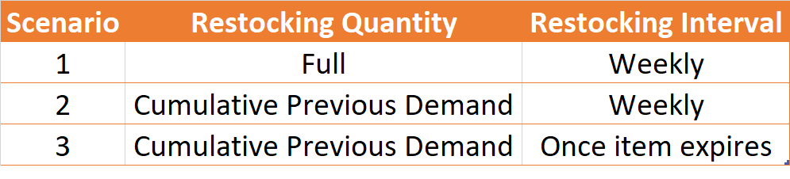
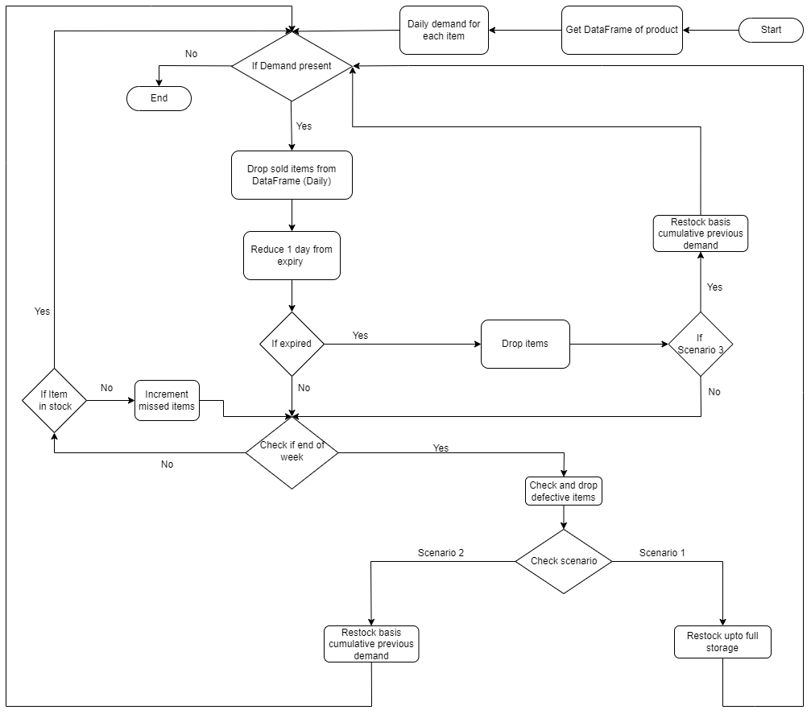
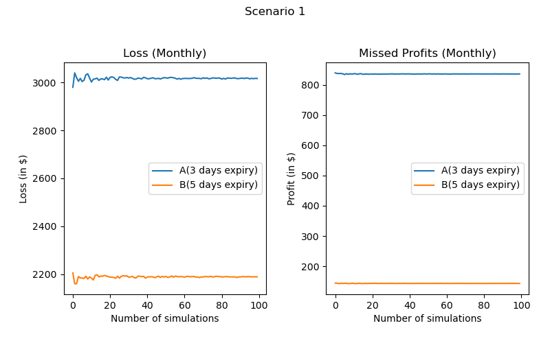
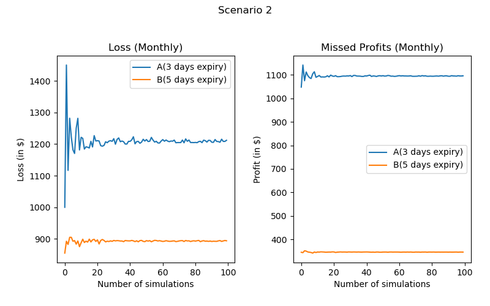
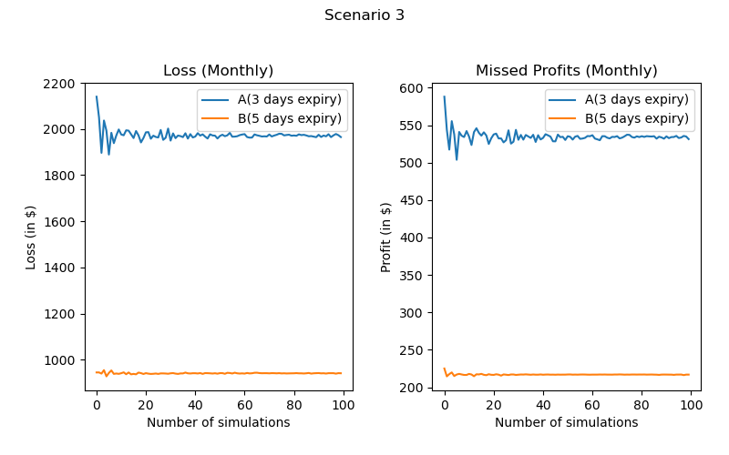
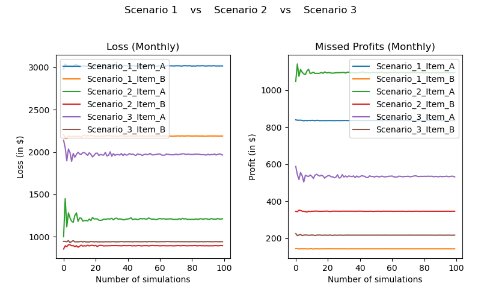
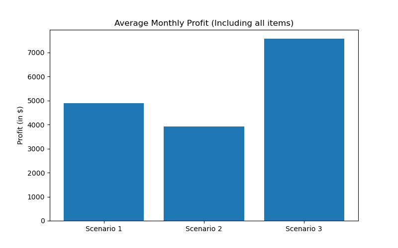

# Perishable products Inventory Management using MC Simulation

Perishable products require accurate inventory control models as their effect on operations management can be critical. Food items such as unprocessed dairy products, or meats or even some pharmaceuticals require proper handling and have a low shelf-life. The restocking size becomes an important variable considering the uncertain demand and limited storage capacity. Products may also suffer from possible damages during deliveries. The importance of the management was particularly observed during the Pandemic. Thus, it is crucial to have an estimate of demand while restocking so that wastage is avoided and profits are maximized. 

## Objective:
Our main objective is to investigate the effect of adopting an optimum inventory for these perishable goods. We plan on using Monte Carlo in order to simulate various scenarios and thus calculate loss, missed profit and effective profit for each case.

## Scenarios:
We have successfully created experiments for 3 different scenarios.

## Hypothesis:
Hypothesis 1: Restocking weekly on the basis of pervious cumulative demand will reduce losses

Hypothesis 2: Restocking dynamically i.e., as soon as the stock finishes on the basis of previous cumulative demand will maximize Profits

## Flowchart:

## Assumptions:
We have designed the model based on the following assumptions:

i.	In each simulation, we are performing the experiment for 28 days i.e. a month.\
ii.	Considering 2 items: A and B. A has a very low-shelf-life i.e. 3 days whereas B has a relatively higher 5 day shelf life.\
iii. Storage capacity for each product is 100 and it is fixed.\
iv.	Cost per product A is 20$ and that per product B is 15$\
v.	Profit per product A is 4$ and that per product B is 3$

Note: If expiry of an item is more than 7 days, then there won’t be any missed opportunities since new stock gets added at the end of each week.
## Variables of uncertainty:
i.	Demand: It uses PERT distribution to calculate demand for each day for each item.
As it can be seen, the stock_demand is a dictionary of lists of with item A and item B as its keys. For 28 days, we can see 28 random values of demand that are generated.

ii.	Defective Items: We generate a random number between 5 and 10. This number represents the percentage of defective items from the total items which are to be restocked.

## Results:
We evaluate the scenarios on the basis of 3 parameters:

i.	Loss\
ii.	Missed Monthly Profit\
iii. Average Monthly Profit

Loss is calculated as (cost of expired items + cost of defective items).

The missed profit is calculated as (profit * orders missed). Orders are missed if there is not enough stock.

Average profit is calculated as (profit * items sold).

It can be seen that for this scenario, losses incurred for item B are lower than that for the item A. The reason behind this is that item B has a longer shelf life when compared to item A. Thus, there is less possibility of wastage due to expiry in case of B.

The missed profit for item A is greater than that of item B because of the same reason that A would expire sooner. As a result, for the item A we miss orders for 4 days whereas for the item B we only miss orders for 2 days in a week.

When compared to scenario 1, here we see that the range of values for losses have reduced significantly. However, we can see an increase in the range of missed profits. 

The losses incurred in this scenario is significantly less than scenario 1 but higher than scenario 2.

Missed profits for item A is least in scenario 1. The reason behind this is that, in previous scenarios orders were missed for 4 days in a week as expiry of item A was 3 days. However, in this scenario, it gets restocked twice in a week. Hence, there is very minimal possibility of orders getting missed.

For item B, missed profits in scenario 3 is less than scenario 2 but greater than scenario 1.

We can get a better look at these comparisons in the following graph.

It can be seen that losses have been cut down to almost 50% in scenario 2 and 3 for both the items when compared to scenario 1. The reason behind this is that we have significantly cut down the wastage due to expiry. As we are restocking on the basis of previous week’s demand, there is a very low possibility of items being overstocked. 

When comparing losses for scenario 2 and 3 with each other, scenario 2 performs better in case of item A as wastage due to expiry will occur for 2 cycles in a week for
scenario 3. No significant difference can be seen for item B.

For missed profits, scenario 3 performs best in case of item A as very less orders are missed because restocking is done twice in a week. For item B, scenario 1 still performs the best, however, scenario 3 is a better performer than scenario 2.

When we look at average profits for both items over a month, we note that profit gained in scenario 3 is far better than previous scenarios. This is because, number of items sold is maximum in case of scenario 3 as we rarely miss any orders due to dynamic restocking. At the same time, wastage due to expiry is also minimal due to restocking on the basis of cumulative previous demands. In conclusion, we can say that scenario 3 is the ideal case for optimizing costs.

## Thus, we accept both the hypotheses.

Note: The program iterates for 28 days in each simulation. i.e. for 100 simulations, we have 2800 iterations.

